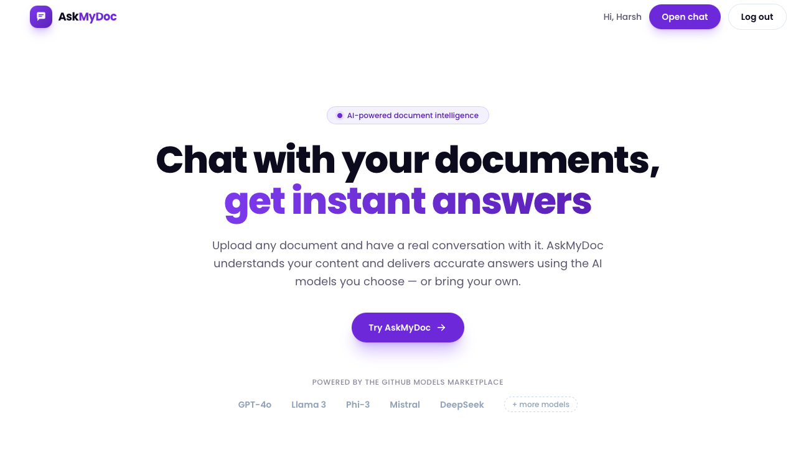
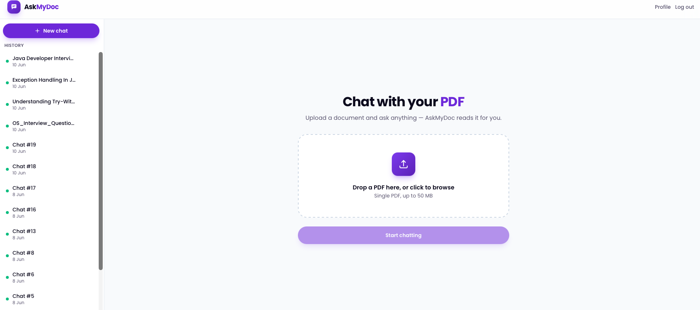
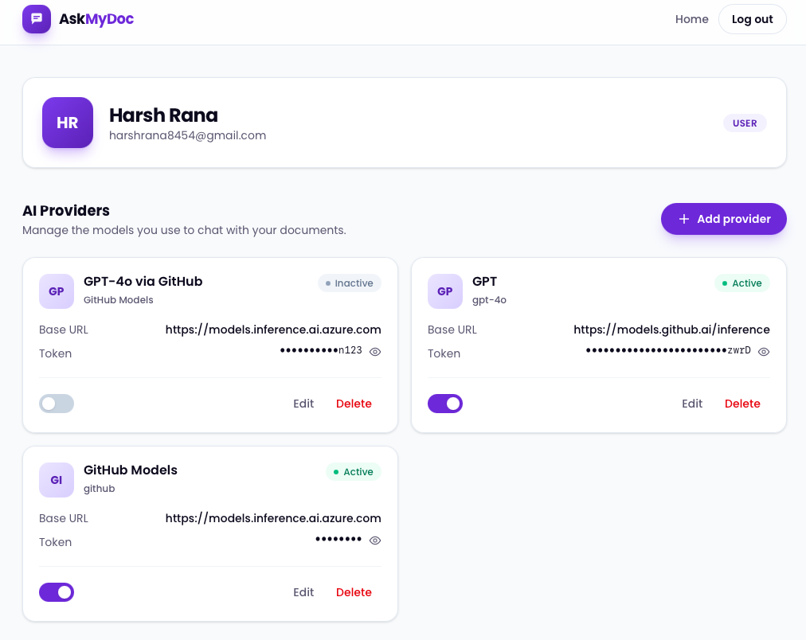
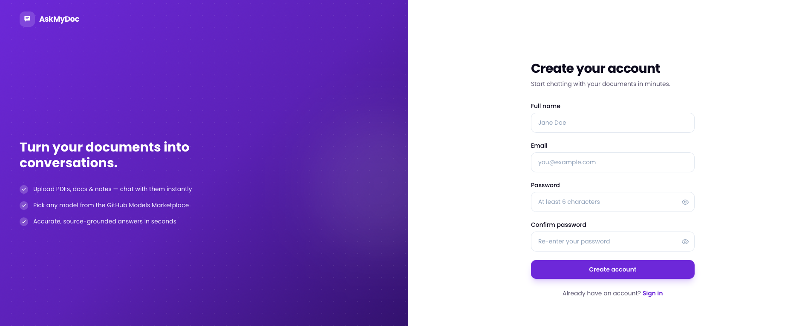

# AskMyDoc

**Chat with your PDFs.** AskMyDoc is a full‑stack Retrieval‑Augmented Generation (RAG) application that lets you upload a PDF and have a grounded conversation about its contents. Documents are parsed, chunked, embedded, and stored in a vector database; at query time the most relevant chunks are retrieved and fed to an LLM along with your question and recent chat history.

It also supports **bring‑your‑own LLM**: each user can register their own OpenAI‑compatible providers (with encrypted API tokens) and switch between them per message, falling back to a built‑in default model.

---

## Table of Contents

- [Features](#features)
- [Architecture](#architecture)
- [Tech Stack](#tech-stack)
- [How It Works (RAG Pipeline)](#how-it-works-rag-pipeline)
- [Screenshots](#screenshots)
- [Project Structure](#project-structure)
- [Prerequisites](#prerequisites)
- [Getting Started](#getting-started)
  - [1. Infrastructure (MySQL, Kafka, ChromaDB)](#1-infrastructure-mysql-kafka-chromadb)
  - [2. Backend](#2-backend)
  - [3. Frontend](#3-frontend)
- [Configuration](#configuration)
- [API Reference](#api-reference)
- [Data Model](#data-model)
- [Security Notes](#security-notes)

---

## Features

- 📄 **PDF upload & ingestion** — drag‑and‑drop a PDF; text is extracted with Apache PDFBox.
- ⚡ **Asynchronous processing** — ingestion runs off‑request via **Apache Kafka**, so uploads return immediately and the document status moves `PENDING → PROCESSING → READY/FAILED`.
- 🔍 **Semantic search** — chunks are embedded locally (Spring AI Transformers) and stored in **ChromaDB**; queries retrieve the top‑K most relevant chunks (cosine similarity).
- 💬 **Grounded chat** — answers are generated from retrieved context plus the last 10 messages of conversation history.
- 🏷️ **Auto‑generated chat titles** — the first question yields a short descriptive title via the LLM.
- 🔑 **Bring your own LLM** — register multiple OpenAI‑compatible providers per user; bearer tokens are **AES‑encrypted** at rest. Toggle, edit, or delete providers from your profile.
- 🔐 **JWT authentication** — stateless auth with BCrypt‑hashed passwords.
- 🎨 **Modern SPA** — React 19 + Vite + Tailwind CSS 4 with Framer Motion animations and Markdown‑rendered answers.

---

## Architecture

```
                          ┌──────────────────────────────────────────────┐
                          │                Frontend (SPA)                 │
                          │   React 19 · Vite · Tailwind · Framer Motion  │
                          │   /  /login  /signup  /chat  /profile         │
                          └───────────────┬──────────────────────────────┘
                                          │  REST  (JWT Bearer, /api proxy)
                                          ▼
        ┌──────────────────────────────────────────────────────────────────────┐
        │                       Backend — Spring Boot 4                          │
        │                                                                        │
        │  Controllers   UserController · ChatController · LlmController         │
        │  Security      JwtAuthFilter · SecurityConfig · EncryptionConfig       │
        │  Services      ChatService · PdfIngestionService · VectorSearchService │
        │                LlmOrchestratorService · LlmProviderService            │
        │                                                                        │
        └─────┬───────────────┬──────────────────┬───────────────┬──────────────┘
              │               │                  │               │
        upload│ event   ingest│            search│         chat  │ (default or BYO)
              ▼               ▼                  ▼               ▼
        ┌──────────┐   ┌────────────┐     ┌────────────┐   ┌──────────────┐
        │  Kafka   │   │  PDFBox +  │     │  ChromaDB  │   │  LLM (OpenAI │
        │  topic   │──▶│  Chunker + │────▶│  vector    │   │  compatible) │
        │          │   │  Embedding │     │  store     │   │              │
        └──────────┘   └────────────┘     └────────────┘   └──────────────┘
                              │
                              ▼
                        ┌──────────┐
                        │  MySQL   │  users · chats · documents · chunks · llm_providers · messages
                        └──────────┘
```

The producer (`KafkaProducer`) emits a `PdfIngestionEvent` on upload; the `KafkaConsumer` picks it up, runs the ingestion pipeline, and updates the chat's document status. Both vector ids (ChromaDB) and raw chunk text (MySQL) are persisted, so retrieval hits the vector store for similarity and MySQL for the original content.

---

## Tech Stack

| Layer | Technologies |
|-------|--------------|
| **Frontend** | React 19, Vite 8, React Router 7, Tailwind CSS 4, Framer Motion, Axios, react-markdown + remark-gfm |
| **Backend** | Java 17, Spring Boot 4, Spring Web MVC, Spring Data JPA, Spring Security, Spring AI 2.0 |
| **AI / RAG** | Spring AI (OpenAI chat client), Spring AI Transformers (local embeddings), ChromaDB vector store, Apache PDFBox |
| **Messaging** | Apache Kafka |
| **Persistence** | MySQL (relational), ChromaDB (vectors) |
| **Auth / Security** | JWT (jjwt 0.12), BCrypt, AES token encryption |
| **Build** | Maven (backend), npm/Vite (frontend) |

---

## How It Works (RAG Pipeline)

**Ingestion (on upload):**

1. `ChatController#createChat` validates the file is a PDF, stores it under `app.upload-dir`, and creates a `Chat` + `Document` row.
2. A `PdfIngestionEvent(chatId, documentId, filePath)` is published to the Kafka topic `pdf.ingestion.request`.
3. `KafkaConsumer` sets the status to `PROCESSING` and calls `PdfIngestionService#ingest`:
   - extract text with **PDFBox**,
   - split into overlapping word windows via `TextChunker` (default `chunk-size=180`, `overlap=40`),
   - embed each chunk and add to **ChromaDB** (tagged with `documentId` metadata),
   - persist chunk text + Chroma vector id to **MySQL**.
4. On success the chat becomes `READY`; on error, `FAILED`.

**Query (on message):**

1. `ChatController#sendMessage` ensures the chat is `READY` and owned by the caller.
2. `VectorSearchService#search` runs a similarity search (top‑K = 5) filtered to the document's id, then loads the matching chunk text from MySQL.
3. `PromptBuilder` assembles a prompt: system instruction + retrieved chunks + last 10 messages of history + the current question.
4. The prompt is sent either to the built‑in **GPT‑4o‑mini** chat client, or — if `llmEnabled` with a `llmProviderId` — to the user's chosen provider via `LlmOrchestratorService` (decrypting the stored bearer token).
5. The answer (and provider used) is saved as an assistant message and returned. The first message also triggers auto‑title generation.

---

## Screenshots

### Landing



### Chat — Upload a PDF

The chat workspace with the chat history sidebar and the PDF dropzone.



### Profile & LLM Providers

Manage your account and bring-your-own OpenAI-compatible providers (encrypted tokens, toggle active/inactive).



### Sign Up



---

## Project Structure

```
AskMyDoc/
├── backend/                         # Spring Boot application
│   └── src/main/java/com/askmydoc/backend/
│       ├── controller/              # REST endpoints (User, Chat, Llm)
│       ├── service/                 # Chat, PdfIngestion, VectorSearch, LlmOrchestrator, LlmProvider, User
│       ├── kafka/                   # Producer, Consumer, PdfIngestionEvent
│       ├── chromadb/                # EmbeddingConfig (Chroma + Transformers beans)
│       ├── security/                # JwtUtil, JwtAuthFilter, SecurityConfig, EncryptionConfig, UserDetailsServiceImpl
│       ├── model/                   # JPA entities: User, Chat, Document, DocumentChunk, ChatMessage, LlmProvider
│       ├── repository/              # Spring Data JPA repositories
│       ├── dto/                     # Request/response DTOs
│       ├── utils/                   # TextChunker, PromptBuilder, AiConfig
│       └── exception/               # GlobalExceptionHandler, ErrorResponse
│
└── frontend/                        # React + Vite SPA
    └── src/
        ├── pages/                   # Landing, Login, Signup, Chat, Profile
        ├── components/              # Header, Footer, Hero, ProtectedRoute, chat/, auth/, profile/
        ├── context/                 # AuthContext
        ├── lib/                     # api.js (Axios client + auth/chat/llm APIs)
        └── assets/
```

---

## Prerequisites

- **Java 17+** and Maven (the bundled `./mvnw` wrapper works)
- **Node.js 18+** and npm
- **MySQL 8+**
- **Apache Kafka** (with ZooKeeper or KRaft) on `localhost:9092`
- **ChromaDB** running on `localhost:8000`
- An **OpenAI‑compatible API key** for the default chat model (the project is configured against the Azure AI inference / GitHub Models endpoint, but any OpenAI‑compatible endpoint works)

---

## Getting Started

### 1. Infrastructure (MySQL, Kafka, ChromaDB)

Start the supporting services. Example using Docker:

```bash
# MySQL
docker run -d --name askmydoc-mysql -p 3306:3306 \
  -e MYSQL_ROOT_PASSWORD=your_password \
  -e MYSQL_DATABASE=askmydoc mysql:8

# ChromaDB
docker run -d --name askmydoc-chroma -p 8000:8000 chromadb/chroma

# Kafka — use your preferred distribution / docker-compose listening on localhost:9092
```

The database `askmydoc` is created automatically (`createDatabaseIfNotExist=true`) and JPA generates the schema (`ddl-auto=update`).

### 2. Backend

```bash
cd backend

# Copy the example config and fill in your secrets
cp src/main/resources/application.properties.example src/main/resources/application.properties

# Edit application.properties (see Configuration below), then run:
./mvnw spring-boot:run
```

The API starts on **http://localhost:8080**.

### 3. Frontend

```bash
cd frontend
npm install
npm run dev
```

The app starts on **http://localhost:5173** (Vite). API calls to `/api` are proxied to `http://localhost:8080` (see `vite.config.js`), so no CORS setup is needed in development.

For a production build:

```bash
npm run build && npm run preview
```

---

## Configuration

Backend configuration lives in `backend/src/main/resources/application.properties`. Key settings (use the provided `.example` file as a template and supply your own secrets):

| Property | Description |
|----------|-------------|
| `spring.datasource.username` / `password` | MySQL credentials |
| `jwt.secret` | Secret used to sign JWTs |
| `encryption.secret-key` | Key used to AES‑encrypt stored LLM bearer tokens |
| `spring.kafka.bootstrap-servers` | Kafka broker (default `localhost:9092`) |
| `topicNameRequest` | Ingestion topic (`pdf.ingestion.request`) |
| `chroma.url` | ChromaDB URL (default `http://localhost:8000`) |
| `chroma.collection-name` | Vector collection (`rag_chunks`) |
| `chunker.chunk-size` / `chunker.overlap` | Chunking window in words (default `180` / `40`) |
| `spring.ai.openai.api-key` | Default chat model API key |
| `spring.ai.openai.base-url` | Default chat model endpoint |
| `spring.ai.openai.chat.options.model` | Default model (`gpt-4o-mini`) |
| `app.upload-dir` | Where uploaded PDFs are stored (`uploads`) |

> Do **not** commit real secrets. Keep your `application.properties` out of version control and share only the `.example` file.

---

## API Reference

All endpoints are under `/api`. Everything except `/api/auth/**` requires an `Authorization: Bearer <jwt>` header.

### Auth

| Method | Endpoint | Description |
|--------|----------|-------------|
| `POST` | `/api/auth/register` | Register (`name`, `email`, `password`) |
| `POST` | `/api/auth/login` | Login → `{ token, user }` |
| `POST` | `/api/auth/logout` | Logout |
| `GET`  | `/api/users/profile` | Current user's profile |
| `DELETE` | `/api/users/{id}` | Delete a user |

### Chat

| Method | Endpoint | Description |
|--------|----------|-------------|
| `POST` | `/api/chat/createChat` | Upload a PDF (multipart `file`) → creates a chat |
| `GET`  | `/api/chat` | List the user's chats |
| `GET`  | `/api/chat/{chatId}` | Get a single chat (incl. document status) |
| `GET`  | `/api/chat/{chatId}/messages` | Get all messages in a chat |
| `POST` | `/api/chat/{chatId}/message` | Ask a question (`question`, `llmProviderId`, `llmEnabled`) |
| `DELETE` | `/api/chat/{chatId}` | Delete a chat |

### LLM Providers

| Method | Endpoint | Description |
|--------|----------|-------------|
| `GET`  | `/api/llm-provider/user/{userId}` | List providers |
| `GET`  | `/api/llm-provider/user/{userId}/active` | List active providers |
| `POST` | `/api/llm-provider/add-llm/user/{userId}` | Add a provider |
| `PUT`  | `/api/llm-provider/user/{userId}/{llmId}` | Update a provider |
| `PATCH`| `/api/llm-provider/user/{userId}/{llmId}/toggle` | Toggle active state |
| `DELETE` | `/api/llm-provider/user/{userId}/{llmId}` | Delete a provider |
| `GET`  | `/api/llm-provider/user/{userId}/{providerId}/token` | Get the decrypted token |

---

## Data Model

| Entity | Key fields | Notes |
|--------|-----------|-------|
| **User** | `name`, `email` (unique), `password` (BCrypt), `role` | |
| **Chat** | `title`, `documentStatus` (`PENDING/PROCESSING/READY/FAILED`) | belongs to a User |
| **Document** | `fileName`, `originalName` | one‑to‑one with Chat |
| **DocumentChunk** | `chunkIndex`, `content`, `chromaVectorId` | links MySQL text ↔ Chroma vector |
| **ChatMessage** | `role` (`USER/ASSISTANT`), `question`, `answer`, `llmProviderUsed` | |
| **LlmProvider** | `providerName`, `displayName`, `baseUrl`, `bearerToken` (encrypted), `isActive` | OpenAI‑compatible, per user |

---

## Security Notes

- Passwords are hashed with **BCrypt**; authentication is **stateless JWT** (`SessionCreationPolicy.STATELESS`).
- User‑supplied LLM bearer tokens are **AES‑encrypted** before being stored and decrypted only when calling the provider.
- Chat and provider operations verify ownership (`chat.getUser().getId()` / `findByIdAndUserId`) to prevent cross‑user access.
- Keep `jwt.secret`, `encryption.secret-key`, database credentials, and API keys out of source control. The repository's `application.properties.example` documents the required keys without values.
